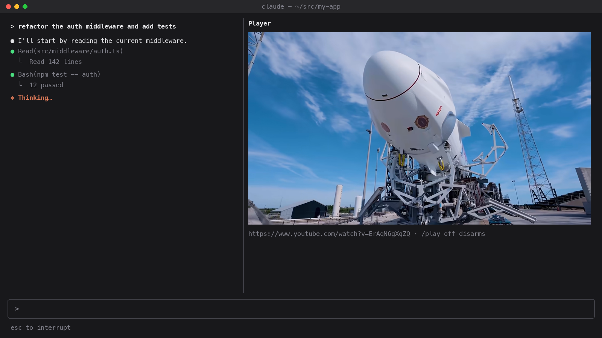

# ClaudeVideoMod

A [Claude Code](https://claude.com/claude-code) mod that plays videos in a pane while Claude works.

Every time Claude starts a turn, a pane opens beside the transcript and a video plays, with sound. When the turn ends it pauses and the pane closes. The next turn picks up where it stopped, and when a video ends the next one from your source starts.



<sub>Mockup of the pane in Ghostty. Video: NASA, SpaceX Crew-13 trailer.</sub>

## Features

- **Plays while Claude works.** The pane opens on `turn.start` and closes on `turn.complete`. Playback resumes from the same spot next turn.
- **Any yt-dlp source.** A single video, a playlist, a channel, a search (`ytsearch20:lofi`), or a direct `.mp4` / `.m3u8` URL.
- **Real pixels.** Frames go to the terminal through the kitty graphics protocol, at playback speed, 30 times a second.
- **Sound** through `ffplay`, no extra window.
- **Configurable** through `/config`. The default source is NASA's YouTube channel.

## Requirements

| What | Why |
| --- | --- |
| Claude Code CLI with mods (function-hook plugins) | the mod runs in the CLI; mods that start processes don't run in the desktop app |
| [Ghostty](https://ghostty.org) or [kitty](https://sw.kovidgoyal.net/kitty/) | they draw images in the terminal; elsewhere the pane shows a placeholder |
| a terminal at least **144 columns** wide | Claude Code only places a pane it opens unasked from that width |
| `ffmpeg` and `ffplay` on your `PATH` | decoding and sound (`brew install ffmpeg`) |
| [`uv`](https://docs.astral.sh/uv/) on your `PATH` | the mod runs `uvx yt-dlp`, so yt-dlp itself needs no install |

## Install

```sh
claude plugin marketplace add ssenge/ClaudeVideoMod
claude plugin install player@claude-video-mod
```

Restart Claude Code or run `/reload-plugins`. Then send Claude any message: NASA's latest video starts while it works.

To try it without installing, for one session from a clone:

```sh
git clone https://github.com/ssenge/ClaudeVideoMod.git
claude --plugin-dir ./ClaudeVideoMod/player
```

## Usage

| Command | Does |
| --- | --- |
| `/play` | arm the configured source |
| `/play <url>` | arm another source for this session (`/play ytsearch20:jazz` works too) |
| `/play off` | stop and disarm; closing the pane does the same |

## Configuration

Open `/config` and find the **player** section, or edit `~/.claude/settings.json`:

```json
{
  "pluginConfigs": {
    "player@claude-video-mod": {
      "options": {
        "source": "ytsearch20:lofi hip hop",
        "pick": "random"
      }
    }
  }
}
```

The key is `player@inline` when the mod is loaded with `--plugin-dir`.

| Option | Default | Meaning |
| --- | --- | --- |
| `source` | `https://www.youtube.com/@NASA/videos` | what to play. Empty: nothing plays until `/play <url>` |
| `pick` | `newest` | `newest` plays in the source's order (a channel lists newest first); `random` picks any of its first 20 |
| `linkPattern` | empty | for pages yt-dlp cannot list as a playlist: a regular expression matching the video links on the page. The mod downloads the page and plays the matching links |

### Source examples

| Source | Plays |
| --- | --- |
| `https://www.youtube.com/@NASA/videos` | a channel, newest first |
| `https://www.youtube.com/playlist?list=…` | a playlist, in order |
| `ytsearch20:relaxing nature 4k` | the top 20 search results |
| `https://www.youtube.com/watch?v=…` | one video |
| `https://example.com/stream.m3u8` | a direct stream |

`linkPattern` example for a page that yt-dlp can't list, but that links to videos it can play (placeholder URLs):

```json
"options": {
  "source": "https://example.com/videos/latest",
  "linkPattern": "https://example\\.com/watch/[0-9]+"
}
```

## How it works

```
yt-dlp ──► stream URLs ──► ffmpeg ──► frame.rgb ──► $.ui.blit ──► pane (kitty graphics)
                      └──► ffplay ──► speakers
```

1. `yt-dlp` lists the source's first 20 entries and resolves the next one to stream URLs. For YouTube that's a video stream and an audio stream, for most other sites a single combined one.
2. On `turn.start`, `ffmpeg` decodes the video at playback speed (`-re`) to 640×360 raw RGB. It rewrites a single frame file, atomically, so the terminal never reads half a frame.
3. The mod swaps the pane's keyed `Image` to that file 30 times a second with `$.ui.blit`. The terminal reads the file directly, so no pixel data goes through Claude Code.
4. `ffplay -nodisp` plays the audio from the same position.
5. On `turn.complete` both processes stop and the position is saved. On the next turn both start again with `-ss <position>`.

The whole mod is one file: [`player/hooks/register.tsx`](player/hooks/register.tsx).

## Limitations

- Each turn restarts the stream from the saved position, so it takes a second or two to buffer. Very short turns may end before a frame shows.
- Stream links are fetched once per video. Signed CDN links usually expire after a few hours; run `/play` again then.
- Only a source's first 20 entries are used.
- Picture and sound are separate processes, so they can drift apart on long videos. There's no pause or seek.
- If every entry of a source fails, it's retried each turn until `/play off`.
- The pane opens by itself whenever Claude works. Before a screen share, `/play off`, or leave `source` empty and arm it by hand.

## Troubleshooting

| Symptom | Fix |
| --- | --- |
| "widen the terminal to see the video" | make the window at least 144 columns wide |
| the pane says "video (needs kitty or Ghostty)" | your terminal can't draw images; use Ghostty or kitty, and not inside tmux |
| status line shows `player: …` | a frame was refused; the reason follows. `claude --debug` logs ffmpeg's errors |
| nothing plays | check `which ffmpeg ffplay uvx`, then `uvx yt-dlp -g <your source>` |

## Development

```sh
claude plugin validate player   # what the engine would load or refuse
claude plugin test player       # runs player/hooks/*.test.ts
```

Once the engine has loaded the mod, it writes the API types to `player/.claude-plugin/types/` (git-ignored), and `npx tsc -p player` type-checks it.
